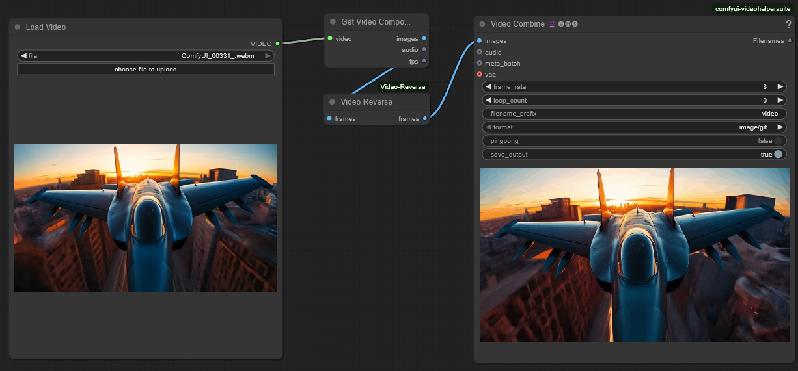

# ComfyUI Video Reverse

A tool to reverse the frames of a videos (WebM, WebP, MP4, Animated GIF) using ComfyUI.

## Install ComfyUI Video Reverse

1.  Navigate to your `ComfyUI/custom_nodes` folder.

2.  Run,

    `git clone https://github.com/Sean-Bradley/ComfyUI-Image-Compare.git`

3.  Restart ComfyUI

You will find the new **Video Reverse** node in the **Nodes** menu item under **SBCODE**.

Or you can double click the workspace and search for `video reverse`.

## Example Usage

### WebP to Reversed WebP

### MP4 to Reversed MP4 using Video Helper Suite (VHS)

### WebP to Reversed WebM

### WebM to Reversed MP4 using VHS

### WebM to Reversed WebM

### MP4 to Reversed MP4

### Animated GIF to Reversed Animated GIF

### WebM to Reversed Animated GIF using VHS

